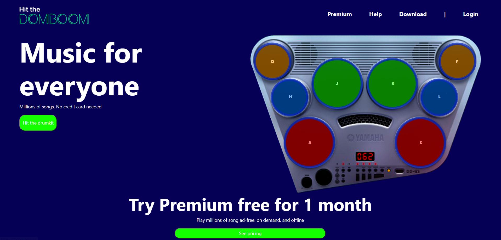

<a name="readme-top"></a>
<br />
<div align="center">
  <a href="https://github.com/jumelis/music-app-eq1-da">
    
  </a>

  <h3 align="center">MUSIC APP</h3>

  <p align="center">
    Music for everyone
    <br />
    <a href="https://github.com/jumelis/music-app-eq1-da"><strong>Explore the docs »</strong></a>
    <br />
    <br />
    <a href="https://jumelis.github.io/music-app-eq1-da/#">View Demo</a>
</div>

<!-- TABLE OF CONTENTS -->
<details>
  <summary>Table of Contents</summary>
  <ol>
        <li><a href="#built-with">Built With</a></li>
        <li><a href="#prerequisites">Prerequisites</a></li>
        <li><a href="#installation">Installation</a></li>
      </ul>
    </li>
    <li><a href="#contact">Contact</a></li>
  </ol>
</details>
<!-- ABOUT THE PROJECT -->
<a href="https://jumelis.github.io/music-app-eq1-da/#">
    
  </a>
    <br />
    <br />
Music App corresponds to the second group project of the Digital Academy bootcamp, which aims to develop competences in the Javascript programming language.

<p align="right">(<a href="#readme-top">back to top</a>)</p>


### Built With

The project was built in Bootstrap and the functionalities in Javascript.
* [![Bootstrap][Bootstrap.com]][Bootstrap-url]
    <br />
 

<p align="right">(<a href="#readme-top">back to top</a>)</p>


### Prerequisites

No library or framework is required to install this repository.

### Installation


1.  Clone the repository
   ```sh
   https://github.com/jumelis/music-app-eq1-da.git
   ```

<p align="right">(<a href="#readme-top">back to top</a>)</p>

<!-- CONTACT -->
## Contact

Alejandro Lopez - alejandro.93lf@gmail.com
<br />
Carlos Garlo - dosdedoce@gmail.com
<br />
kevin Panjon - kevinpanjonjara@gmail.com
<br />
Jumelis Rosales - jumelisrosales@gmail.com
<br />
Santiago Matilla - esematillajr@gmail.com


Project Link: [https://github.com/jumelis/music-app-eq1-da.git](https://github.com/jumelis/music-app-eq1-da.git)

<p align="right">(<a href="#readme-top">back to top</a>)</p>


<!-- MARKDOWN LINKS & IMAGES -->
[contributors-url]: https://github.com/jumelis/music-app-eq1-da/graphs/contributors
[Bootstrap.com]: https://img.shields.io/badge/Bootstrap-563D7C?style=for-the-badge&logo=bootstrap&logoColor=white
[Bootstrap-url]: https://getbootstrap.com